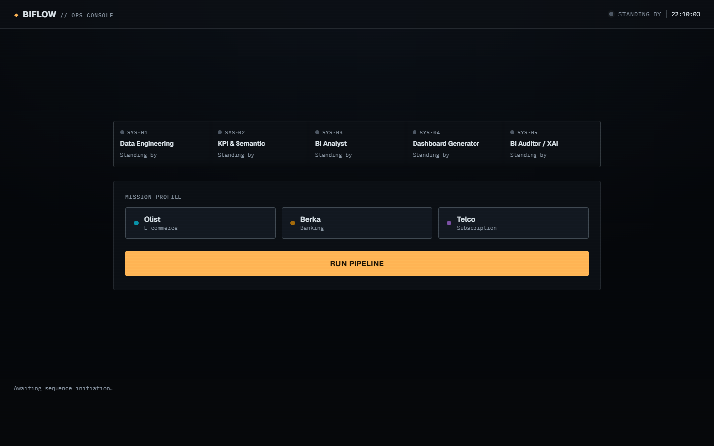
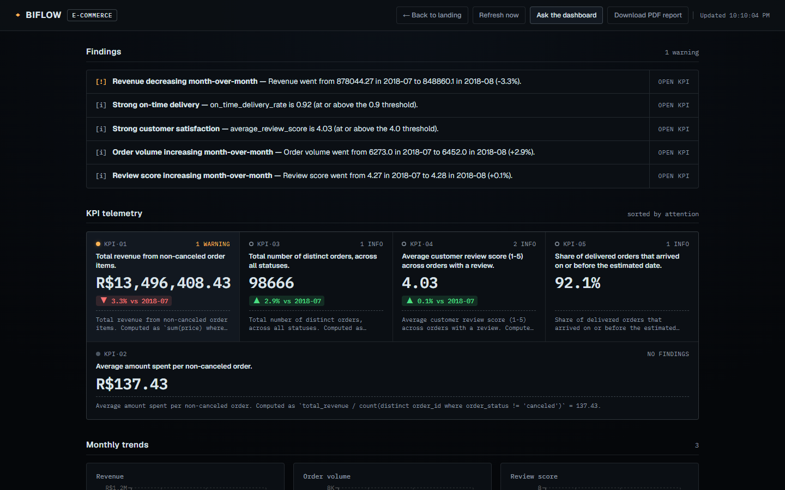
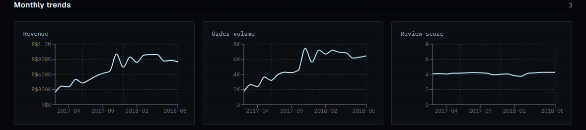
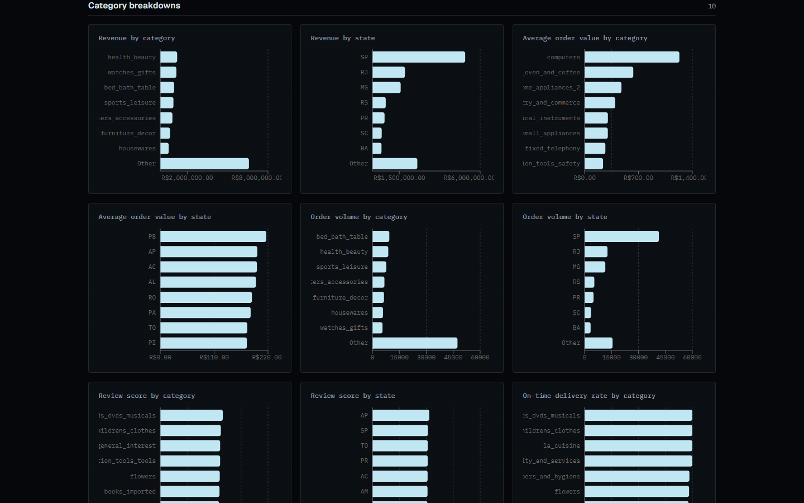
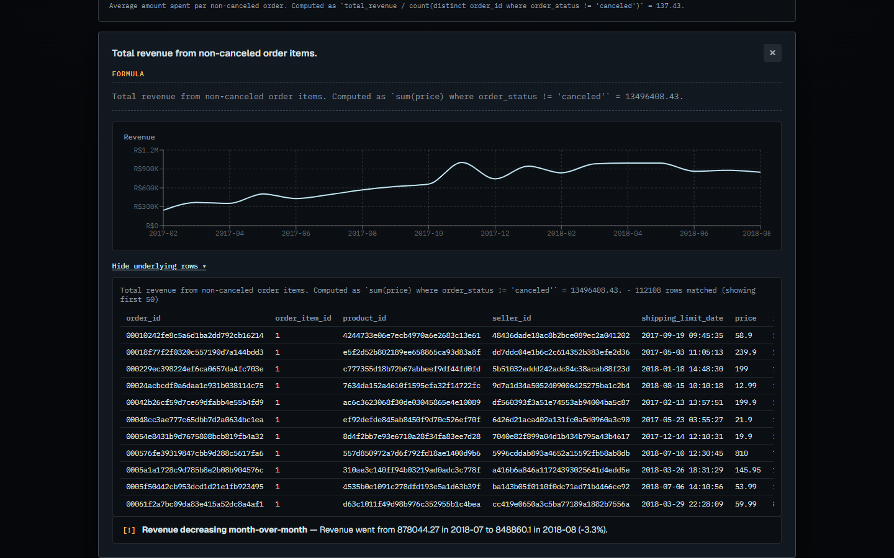

# BIFlow — Multi-Agent BI Pipeline

BIFlow is a multi-agent system that automates a Business Intelligence
pipeline from raw data to an explainable, interactive dashboard.

For a detailed explanation of every component, design decision, and the
real bugs found and fixed along the way, see
[`docs/IMPLEMENTATION.md`](docs/IMPLEMENTATION.md).

## Architecture

```
RAW DATA
   |
   v
[Orchestrator Agent] --coordinates--> all agents below
   |
   +-> [Data Engineering Agent]   (Profiling + Quality/Cleaning + ETL)
   |        |
   |        v
   +-> [BI Semantic & KPI Agent]   (KPI definitions, formulas)
   |        |
   |        v
   +-> [BI Analyst Agent]          (Trends, anomalies, insights)
   |        |
   |        v
   +-> [Dashboard Generator Agent] (JSON API for the Next.js dashboard)
   |        |
   |        v
   +-> [BI Auditor / XAI Agent]    (Validation, explanations, traceability)
```

Each agent communicates with the Orchestrator only — agents do not call
each other directly. The Orchestrator passes validated Pydantic objects
(see `shared/schemas/data_contracts.py`) between agents and logs every step
for the Auditor/XAI agent to consume.

See [`docs/architecture.md`](docs/architecture.md) for more detail.

## Team assignment

| Component | Owner |
|---|---|
| Data Engineering Agent (Profiler + Cleaning + ETL) | Mohamed Aziz Ouertatani |
| Orchestrator | Mohamed Aziz Ouertatani |
| Frontend (Next.js dashboard) | Mohamed Aziz Ouertatani |
| BI Semantic & KPI Agent | Mohamed Aymen Hamzeoui |
| BI Analyst Agent | Mohamed Aymen Hamzeoui |
| Dashboard Generator Agent | Mohamed Aymen Hamzeoui |
| BI Auditor/XAI Agent | Mohamed Aymen Hamzeoui |

## Repository layout

- `orchestrator/` — coordinates the pipeline across all agents
- `agents/` — one folder per agent, each independently runnable/testable
- `frontend/` — Next.js dashboard (polls the Dashboard Generator Agent's API)
- `shared/` — shared Pydantic schemas, config, and utils used by all components
- `data/` — raw/processed data (gitignored) and a committed sample dataset
- `docs/` — architecture notes, KPI catalog, report templates, and the
  original project skeleton brief
- `tests/` — end-to-end integration test for the full pipeline
- [`DESIGN.md`](DESIGN.md) — the dashboard's "Audit Console" design system
  (tokens, typography, component specs) generated from the shipped UI

## Dashboard

`/` is a landing/control-panel screen: pick a domain, watch the five agents
run in sequence, then land on `/dashboard?domain=<id>` for that domain's
results. The dashboard is a single "telemetry wall": findings first, then a KPI
grid sorted by how much attention each KPI needs, then monthly trends and
category breakdowns. Every KPI traces back to its formula, and clicking one
opens a detail panel with its trend and the underlying rows. See
[`DESIGN.md`](DESIGN.md) for the visual design system and
[`docs/IMPLEMENTATION.md`](docs/IMPLEMENTATION.md) for the architecture
history. The Auditor/XAI Agent also generates a multi-section PDF report
(`agents/dashboard_agent/report.py`) styled to match the dashboard, available
from the "Download PDF report" button in the header.



*Landing page — pick a domain and run the five-agent pipeline.*



*Dashboard — findings above the KPI wall, sorted by attention.*



*Monthly trends for each KPI that has a time series.*



*Category breakdowns — sums and counts fold the long tail into "Other"; averages and rates show only the top groups, since they can't be added together.*



*Drilling into a KPI shows its formula, its trend and the rows behind the number.*

The screenshots show the e-commerce domain run on the full Olist dataset;
a run on `data/sample/olist` shows the same layout with smaller numbers.

The API resolves `?domain=<id>` to `data/processed/dashboard_layout_<id>.json`
(falling back to `dashboard_layout.json` when no domain is given), so each
domain needs its own pipeline run before the landing page can show it — see
"Seeding all three domains" below.

## Getting started

### Option A: docker-compose (everything containerized)

```bash
docker-compose up -d
```

Run the pipeline once to generate data:

```bash
docker compose exec orchestrator python -m orchestrator data/sample/olist e-commerce
```

Open the dashboard: **http://localhost:3000**

### Option B: manual (no Docker)

```bash
pip install -r requirements-dev.txt
for req in agents/*/requirements.txt orchestrator/requirements.txt; do pip install -r "$req"; done
```

Run the pipeline:

```bash
python -m orchestrator data/sample/olist e-commerce --no-postgres
```

Then, in two separate terminals, start the API and the frontend:

```bash
uvicorn agents.dashboard_agent.api:create_app --factory
```

```bash
cd frontend && npm install && npm run dev
```

Open **http://localhost:3000**.

### Seeding all three domains

The landing page's domain switcher reads whichever `dashboard_layout_<id>.json`
files exist under `data/processed/` (gitignored — run these yourself after
cloning). Run the pipeline once per domain, pointing `--dashboard-layout-path`
at the id the frontend uses (`e-commerce`, `banking`, `telco`):

```bash
python -m orchestrator data/sample/olist e-commerce --no-postgres --dashboard-layout-path data/processed/dashboard_layout_e-commerce.json
python -m orchestrator data/sample/banking banking --no-postgres --dashboard-layout-path data/processed/dashboard_layout_banking.json
python -m orchestrator data/sample/telco telco --no-postgres --dashboard-layout-path data/processed/dashboard_layout_telco.json
```

### Other useful commands

- `python -m orchestrator data/raw/olist e-commerce` — run against the full
  dataset instead of the 500-order sample (needs `data/raw/olist/`
  populated with the raw CSVs — gitignored, not committed)
- `python -m orchestrator data/sample/banking banking --no-postgres` — run
  the pipeline against the banking domain (Berka dataset sample)
- `python -m orchestrator data/sample/telco telco --no-postgres` — run
  the pipeline against the telco domain (IBM Telco Customer Churn sample)
- `pytest` — run the Python test suite
- `cd frontend && npm test` — run the frontend test suite
- Drop `--no-postgres` to also load results into Postgres
  (`localhost:5433`, user/pass/db all `biflow`)

Each agent also has its own `requirements.txt` and `tests/` — see that
agent's `README.md` for local dev instructions.

## Dataset

BIFlow uses the [Olist Brazilian E-Commerce](https://www.kaggle.com/datasets/olistbr/brazilian-ecommerce)
dataset (`business_domain="e-commerce"`):

- `data/raw/olist/` — full dataset (gitignored, not committed)
- `data/sample/olist/` — small committed subset (500 orders + related rows)
  for local dev and tests — see [`data/sample/README.md`](data/sample/README.md)

## Status

All 5 agents and the Orchestrator are implemented and wired end-to-end
against the Olist sample data (and verified against the full ~99k-order
dataset too) — see "Getting started" above to run it. `BIFlowOrchestrator().run_pipeline(raw_dataset)`
is the underlying Python entrypoint if you'd rather call it directly than
via the CLI. CI runs both the Python suite (including real-Postgres tests)
and the frontend suite (lint, Jest, build) on every push/PR to `main` —
see [`.github/workflows/tests.yml`](.github/workflows/tests.yml).

Postgres loading is wired in and **on by default for the CLI** (opt-out
with `--no-postgres`); it stays **opt-in** at the library level
(`BIFlowOrchestrator`/`DataEngineeringAgent`'s `database_url` param) so
tests aren't coupled to a live database unless they ask. See
[`agents/data_engineering_agent/README.md`](agents/data_engineering_agent/README.md#postgres-loading-opt-in)
for the host-vs-container connection details, including the port 5433 remap.

## Next steps

1. ~~Scaffold the skeleton~~ — done.
2. ~~Add a small sample dataset to `data/sample/`~~ — done, using Olist.
3. ~~Get `docker-compose up` running with all stub services~~ — done.
4. ~~Implement all 5 agents + Orchestrator wiring~~ — done.
5. ~~Load the Data Engineering Agent's analytical table into Postgres~~ — done, opt-in.
6. ~~Replace threshold-only "trend detection" with real time-series analysis~~
   — done: `BIAnalystAgent` now buckets the analytical table by calendar
   month and detects genuine month-over-month trends (see
   `agents/bi_analyst_agent/README.md`).
7. ~~Thread `business_domain` through the shared contracts~~ — done:
   `CleanedDataset` now carries `business_domain` from `RawDatasetRef`, and
   `KPISemanticAgent` reads it from there instead of a constructor default.
8. ~~Make Postgres loading the actual default for real (non-test) pipeline
   runs~~ — done: `python -m orchestrator` is a CLI entrypoint that loads
   into Postgres by default (`--no-postgres` to opt out).
9. ~~Re-run the pipeline against the full dataset in `data/raw/olist`~~ —
   done: runs cleanly in ~9s on ~99k orders, and surfaced a real bug (a
   single trailing stray order in September 2018 made trend detection
   report a false "-100%" collapse) — fixed by excluding months whose
   order count is far below typical volume (see
   `agents/bi_analyst_agent/README.md`).
10. ~~Swap the dashboard for a Next.js frontend~~ — done: the Streamlit UI
    is gone, replaced by `frontend/` (Next.js, polls every 5s) backed by a
    small FastAPI JSON API in `agents/dashboard_agent/api.py`.
11. ~~Add a trend chart to the frontend~~ — done: `frontend/TrendChart.tsx`
    (Recharts) renders each `AnalysisResult.trends["monthly"]` metric as a
    line chart; `monthly_trends.py` now retains the full per-month series
    (not just the previous/latest comparison) for this.
12. ~~Add automated frontend tests~~ — done: Jest + React Testing Library
    (`frontend/src/app/*.test.tsx`), run in CI alongside lint/build.
13. ~~Redesign the dashboard as an explainable "Audit Console"~~ — done: new
    visual system (see [`DESIGN.md`](DESIGN.md)), restructured into a
    WAI-ARIA tablist with keyboard navigation, and an expanded multi-section
    PDF report matching the dashboard's design system.

## License

MIT — see [`LICENSE`](LICENSE).
